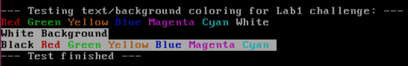

## Lab1 Report
俞一凡 Yifan Yu 1600012998

### Lab Environment
```
Host Machine:		MacBook Pro (Retina 13-inch Early 2015)
OS:					macOS Mojave 10.14.1
CPU:				2.7 GHz Intel Core i5
Memory:				8 GB

Virtual Machine:	Oracle VM VirtualBox 6.0
Memory:				1.5 GB
OS: 				Ubuntu 16.04 LTS (32bit x86) 
Gcc:            	Gcc 5.4.0
Make:           	GNU Make 4.1
Gdb:            	GNU gdb 7.11.1
```

## Part 1: PC Bootstrap

#### x86 Assembly and AT&T Syntax
> **Exercise 1.** Familiarize yourself with the assembly language materials available on the [6.828 reference page](https://pdos.csail.mit.edu/6.828/2018/reference.html). You don't have to read them now, but you'll almost certainly want to refer to some of this material when reading and writing x86 assembly.
> 
> We do recommend reading the section "The Syntax" in [Brennan's Guide to Inline Assembly](http://www.delorie.com/djgpp/doc/brennan/brennan_att_inline_djgpp.html). It gives a good (and quite brief) description of the AT&T assembly syntax we'll be using with the GNU assembler in JOS.

Thanks to ICS, I'm already quite familiar with the x86 assembly language and AT&T syntax. There are a few commands that I have not known previously but are important for JOS, such as ```lgdt``` command.

#### Simulating the x86
We use the [QEMU emulator](http://www.qemu.org/) to emulate a real x86 PC. QEMU can act as a remote debugging target for the [GNU debugger](http://www.gnu.org/software/gdb/) (GDB) which greatly simplifies debugging.

Build and run:

```shell
$ make
+ as kern/entry.S
+ cc kern/entrypgdir.c
+ cc kern/init.c
+ cc kern/console.c
+ cc kern/monitor.c
+ cc kern/printf.c
+ cc kern/kdebug.c
+ cc lib/printfmt.c
+ cc lib/readline.c
+ cc lib/string.c
+ ld obj/kern/kernel
+ as boot/boot.S
+ cc -Os boot/main.c
+ ld boot/boot
boot block is 390 bytes (max 510)
+ mk obj/kern/kernel.img
```
```
$ make qemu-nox
***
*** Use Ctrl-a x to exit qemu
***
qemu-system-i386 -nographic -drive file=obj/kern/kernel.img,index=0,media=disk,format=raw -serial mon:stdio -gdb tcp::26000 -D qemu.log 
6828 decimal is 15254 octal!
entering test_backtrace 5
entering test_backtrace 4
entering test_backtrace 3
entering test_backtrace 2
entering test_backtrace 1
entering test_backtrace 0
leaving test_backtrace 0
leaving test_backtrace 1
leaving test_backtrace 2
leaving test_backtrace 3
leaving test_backtrace 4
leaving test_backtrace 5
Welcome to the JOS kernel monitor!
Type 'help' for a list of commands.
K> 
```
Looks all good!

--
#### The ROM BIOS
Using ```$ make qemu-gdb``` (or ```$ make qemu-nox-gdb```) and ```$ make gdb```, we can connect GDB to QEMU and trace its commands' execution.

Using GDB's ```si``` to step through the commands, we can find that the first command after the PC's booting is:

```
[f000:fff0] 0xffff0:	ljmp   $0xf000,$0xe05b
```
So we know that:  

* The IBM PC starts executing at physical address 0x000ffff0, which is at the very top of the 64KB area reserved for the ROM BIOS.
* The PC starts executing with CS = 0xf000 and IP = 0xfff0.
* The first instruction to be executed is a jmp instruction, which jumps to the segmented address CS = 0xf000 and IP = 0xe05b.

The reason behind such setting is historical (since the 8088 processor) to ensure that the BIOS always gets control of the machine first after power-up or any system restart. On processor reset, the (simulated) processor enters real mode and sets CS to 0xf000 and the IP to 0xfff0, so that execution begins at that (CS:IP) segment address.

**Real mode addressing:** *physical address = 16 \* segment + offset*

--
> **Exercise 2.** Use GDB's ```si``` (Step Instruction) command to trace into the ROM BIOS for a few more instructions, and try to guess what it might be doing. No need to figure out all the details - just the general idea of what the BIOS is doing first.

The BIOS first sets up an interrupt descriptor table and initializes various devices such as the VGA display. After initializing the PCI bus and all the important devices the BIOS knows about, it searches for a bootable device (floppy/hard drive/CD-ROM). When it finds a bootable disk, the BIOS reads the boot loader from the disk and transfers control to it.

## Part 2: The Boot Loader
The `boot loader` is a program that loads an operating system or some other system software for the computer after completion of the power-on self-tests. 

Floppy and hard disks for PCs are divided into 512 byte regions called *sectors*. A sector is the disk's minimum transfer granularity. The first sector of a bootable disk is called the *boot sector*, which is where the boot loader code resides. When the BIOS finds a bootable floppy or hard disk, it loads the 512-byte boot sector into memory at physical addresses 0x7c00 through 0x7dff, and then uses a jmp instruction to set the CS:IP to 0000:7c00, passing control to the boot loader. 

The reason behind the magic number 0x7c00 is historical, more info [here](https://www.glamenv-septzen.net/en/view/6).

For the conventional hard drive boot mechanism we use here, our boot loader fits into a measly 512 bytes. It consists of 2 source files: one assembly `boot/boos.S` and one C `boot/main.c`. Looking through these files and we can find what the boot loader does:

1. Switches the processor from real mode to 32-bit protected mode, in which mode software can access all the memory above 1MB in the processor's physical address space.
2. Reads the kernel from the hard disk by directly accessing the IDE disk device registers via the x86's special I/O instructions.
3. Finally, transfers control to the kernel.

--
> **Exercise 3.** Take a look at the [lab tools guide](https://pdos.csail.mit.edu/6.828/2018/labguide.html), especially the section on GDB commands. Even if you're familiar with GDB, this includes some esoteric GDB commands that are useful for OS work.
> 
> Set a breakpoint at address `0x7c00`, which is where the boot sector will be loaded. Continue execution until that breakpoint. Trace through the code in `boot/boot.S`, using the source code and the disassembly file `obj/boot/boot.asm` to keep track of where you are. Also use the `x/i` command in GDB to disassemble sequences of instructions in the boot loader, and compare the original boot loader source code with both the disassembly in `obj/boot/boot.asm` and GDB.
> 
> Trace into `bootmain()` in `boot/main.c`, and then into `readsect()`. Identify the exact assembly instructions that correspond to each of the statements in `readsect()`. Trace through the rest of `readsect()` and back out into `bootmain()`, and identify the begin and end of the for loop that reads the remaining sectors of the kernel from the disk. Find out what code will run when the loop is finished, set a breakpoint there, and continue to that breakpoint. Then step through the remainder of the boot loader.

* At what point does the processor start executing 32-bit code? What exactly causes the switch from 16- to 32-bit mode?
	* In `boot/boos.S`:
	
	```asm
	lgdt    gdtdesc
  movl    %cr0, %eax
  orl     $CR0_PE_ON, %eax
  movl    %eax, %cr0
  ljmp    $PROT_MODE_CSEG, $protcseg
  ```
	* After the `ljmp $PROT_MODE_CSEG, $protcseg` command, the processor starts executing 32-bit code. `movl %eax, %cr0` sets the `PE` bit in register `CR0`, which exactly causes the switch from 16- to 32-bit mode.
	* `ljmp` command: In real mode or virtual 8086 mode, the former pointer provides 16 bits for the `CS` register. In protected mode, the former 16-bit works as *selector* points to a GDT entry.
	* What the `ljmp` does here: reload `CS` register after the GDT is loaded; Clear the instruction cached in pipeline registers so that the following instructions will be reinterpreted as 32-bit instructions in protected mode; Jump to the next instruction (`$protcseg` actually points to the next instruction). 
	* This `ljmp` can be replaced by `lcall`, but not `jmp` because `jmp` does not reload `CS` register.
	
* What is the *last* instruction of the boot loader executed? 
	* In `obj/boot/boot.asm`, it's
	
	```asm
	7d6b:   ff 15 18 00 01 00       call   *0x10018
	```
	which corresponds to: 
	
	```c
	((void (*)(void)) (ELFHDR->e_entry))();
	```
	in `boot/main.c`.
* and what is the *first* instruction of the kernel it just loaded?
	* In `entry.S`:
	
	```asm
	movw    $0x1234,0x472           # warm boot
	```
* *Where* is the first instruction of the kernel?
	* In `obj/kern/kernel.asm`:
	
	```asm
	f010000c:   66 c7 05 72 04 00 00    movw   $0x1234,0x472
	```
	* The last instruction of the boot loader is `call *0x10018`. Examine `*0x10018` using gdb:
	
	```shell
	(gdb) x/1x 0x10018
	0x10018:	0x0010000c
	```
	* So the first instruction of the kernel is at virtual address `0xf010000c`, physical address `0x0010000c`.
	
* How does the boot loader decide how many sectors it must read in order to fetch the entire kernel from disk? Where does it find this information?
	* The boot loader reads the `program head table` to get all the segment information of the entire kernel from the first page of the disk image it first reads. More specifically, the `ELFHDR->e_phnum` indicates the number of segments of the kernel that the boot loader should read.
	
	```c
     // load each program segment (ignores ph flags)
     ph = (struct Proghdr *) ((uint8_t *) ELFHDR + ELFHDR->e_phoff);
     eph = ph + ELFHDR->e_phnum;
     for (; ph < eph; ph++)
         // p_pa is the load address of this segment (as well
         // as the physical address)
         readseg(ph->p_pa, ph->p_memsz, ph->p_offset);
	```

--
#### Loading the Kernel
> **Exercise 4.** Read about programming with pointers in C. Then download the code for [pointers.c](https://pdos.csail.mit.edu/6.828/2018/labs/lab1/pointers.c), run it, and make sure you understand where all of the printed values come from. In particular, make sure you understand where the pointer addresses in printed lines 1 and 6 come from, how all the values in printed lines 2 through 4 get there, and why the values printed in line 5 are seemingly corrupted.

The printed result of `pointers.c` is:

```shell
$ ./pointer
1: a = 0xbfad1f7c, b = 0x949b008, c = 0xb7f0c244
2: a[0] = 200, a[1] = 101, a[2] = 102, a[3] = 103
3: a[0] = 200, a[1] = 300, a[2] = 301, a[3] = 302
4: a[0] = 200, a[1] = 400, a[2] = 301, a[3] = 302
5: a[0] = 200, a[1] = 128144, a[2] = 256, a[3] = 302
6: a = 0xbfad1f7c, b = 0xbfad1f80, c = 0xbfad1f7d
```

The first line printed is the initial address of the three pointers. In the last line, the address of `a` has not changed, `b = (int *) a + 1;` so `b` is actually `sizeof(int) = 4` byte higher than `a`, `c = (int *) ((char *) a + 1);` so `c` is actually `sizeof(char) = 1` byte higher than `a`;

For the second line, the program first set `c = a` so they both point to the start address of the array `a[]`, and `c[0] = 200` changes `a[0]`. For the third line, `*(c + 2)` corresponds to `c[2]`, `3[c]` equals to `c[3]` therefore the result. The reason behind fourth and fifth lines' result is the same as explained for the last line.

--
#### Link Address and Load Address
* **link address(VMA)**: The link address of a section is the memory address from which the section expects to execute.
* **load address(LMA)**: The load address of a section is the memory address at which that section should be loaded into memory.

- program header table of `obj/boot/boot.out`

```
start address 0x00007c00

Program Header:
    LOAD off    0x00000074 vaddr 0x00007c00 paddr 0x00007c00 align 2**2
         filesz 0x00000230 memsz 0x00000230 flags rwx
   STACK off    0x00000000 vaddr 0x00000000 paddr 0x00000000 align 2**4
         filesz 0x00000000 memsz 0x00000000 flags rwx
```

- program header table of `obj/kern/kernel`

```
start address 0x0010000c

Program Header:
    LOAD off    0x00001000 vaddr 0xf0100000 paddr 0x00100000 align 2**12
         filesz 0x0000712f memsz 0x0000712f flags r-x
    LOAD off    0x00009000 vaddr 0xf0108000 paddr 0x00108000 align 2**12
         filesz 0x0000a300 memsz 0x0000a944 flags rw-
   STACK off    0x00000000 vaddr 0x00000000 paddr 0x00000000 align 2**4
         filesz 0x00000000 memsz 0x00000000 flags rwx
```
Easy to conclude that for boot loader, the link address is the same as the load address. This is not true for the kernel.

--
> **Exercise 5.** Trace through the first few instructions of the boot loader again and identify the first instruction that would "break" or otherwise do the wrong thing if you were to get the boot loader's link address wrong. Then change the link address in boot/Makefrag to something wrong, run make clean, recompile the lab with make, and trace into the boot loader again to see what happens.

No matter what change we make to the boot loader's link address, BIOS still loads the boot loader at `0x7c00`, so the first instructions still work. However, the `lgdt` command will load the GDT from a wrong place in memory. Then after the `ljmp` command, because it's unable to find the correct instructions, QEMU goes totally wrong.

--
> **Exercise 6.** We can examine memory using GDB's x command. The GDB manual has full details, but for now, it is enough to know that the command x/Nx ADDR prints N words of memory at ADDR. (Note that both 'x's in the command are lowercase.) 
> 
> Reset the machine (exit QEMU/GDB and start them again). Examine the 8 words of memory at 0x00100000 at the point the BIOS enters the boot loader, and then again at the point the boot loader enters the kernel. Why are they different? What is there at the second breakpoint?

```shell
(gdb) b *0x7c00
Breakpoint 1 at 0x7c00
(gdb) c
Continuing.
[   0:7c00] => 0x7c00:	cli    

Breakpoint 1, 0x00007c00 in ?? ()
(gdb) x/8x 0x00100000
0x100000:	0x00000000	0x00000000	0x00000000	0x00000000
0x100010:	0x00000000	0x00000000	0x00000000	0x00000000
(gdb) b *0x7d6b
Breakpoint 2 at 0x7d6b
(gdb) c
Continuing.
The target architecture is assumed to be i386
=> 0x7d6b:	call   *0x10018

Breakpoint 2, 0x00007d6b in ?? ()
(gdb) x/8x 0x00100000
0x100000:	0x1badb002	0x00000000	0xe4524ffe	0x7205c766
0x100010:	0x34000004	0x0000b812	0x220f0011	0xc0200fd8
```
We can see that when BIOS enters the boot loader, 8 words of memory at `0x00100000` are all zeros, and then when boot loader enters the kernel, they have non-zero values because the boot loader loads the kernel starting from this address.

## Part 3: The Kernel
#### Virtual memory
OS kernels often like to be linked and run at very high virtual address, such as `0xf0100000`, in order to leave the lower part of the processor's virtual address space for user programs to use. High virtual address is mapped to low physical address such as `0x00100000` through the processor's memory management hardware.

> **Exercise 7.** Use QEMU and GDB to trace into the JOS kernel and stop at the ```movl %eax, %cr0```. Examine memory at 0x00100000 and at 0xf0100000. Now, single step over that instruction using the stepi GDB command. Again, examine memory at 0x00100000 and at 0xf0100000. Make sure you understand what just happened.
> 
> What is the first instruction after the new mapping is established that would fail to work properly if the mapping weren't in place? Comment out the ```movl %eax, %cr0``` in kern/entry.S, trace into it, and see if you were right.

```shell
=> 0x100025:	mov    %eax,%cr0
0x00100025 in ?? ()
(gdb) x/8w 0x00100000
0x100000:	0x1badb002	0x00000000	0xe4524ffe	0x7205c766
0x100010:	0x34000004	0x0000b812	0x220f0011	0xc0200fd8
(gdb) x/8w 0xf0100000
0xf0100000 <_start+4026531828>:	0x00000000	0x00000000	0x00000000	0x00000000
0xf0100010 <entry+4>:	0x00000000	0x00000000	0x00000000	0x00000000
(gdb) si
=> 0x100028:	mov    $0xf010002f,%eax
0x00100028 in ?? ()
(gdb) x/8w 0x00100000
0x100000:	0x1badb002	0x00000000	0xe4524ffe	0x7205c766
0x100010:	0x34000004	0x0000b812	0x220f0011	0xc0200fd8
(gdb) x/8w 0xf0100000
0xf0100000 <_start+4026531828>:	0x1badb002	0x00000000	0xe4524ffe	0x7205c766
0xf0100010 <entry+4>:	0x34000004	0x0000b812	0x220f0011	0xc0200fd8
```

Up the `CR0_PG` flag in `CR0` is set, memory references are treated as physical addresses. Once `CR0_PG` is set, memory references are virtual addresses that get translated by the virtual memory hardware to physical addresses. `entry_pgdir` translates virtual addresses in the range `0xf0000000` through `0xf0400000` to physical addresses `0x00000000` through `0x00400000`, as well as virtual addresses `0x00000000` through `0x00400000` to physical addresses `0x00000000` through `0x00400000`. 

Comment out the ```movl %eax, %cr0``` and run again, we can see that ```jmp *%eax``` would fail because address ```0xf010002c``` in ```%eax``` exceed the RAM space:

```shell
=> 0x10002a:	jmp    *%eax
0x0010002a in ?? ()
(gdb) p /x $eax
$1 = 0xf010002c
(gdb) si
=> 0xf010002c <relocated>:	add    %al,(%eax)
relocated () at kern/entry.S:74
74		movl	$0x0,%ebp			# nuke frame pointer
(gdb) si
Remote connection closed

```

In the qemu window:
```qemu: fatal: Trying to execute code outside RAM or ROM at 0xf010002c```

--
#### Formatted Printing to the Console
> **Exercise 8.** We have omitted a small fragment of code - the code necessary to print octal numbers using patterns of the form "%o". Find and fill in this code fragment.

```c
    // (unsigned) octal
    case 'o':
        num = getuint(&ap, lflag);
        base = 8;
        goto number;
```

1. Explain the interface between `printf.c` and `console.c`. Specifically, what function does `console.c` export? How is this function used by `printf.c`?  
	* `console.c` exports `cputchar`, `getchar`, `iscons`, while `cputchar` is used as a parameter when `printf.c` calls `vprintfmt` in `printfmt.c`.
2. Explain the following from `console.c`: 

	```c
1      if (crt_pos >= CRT_SIZE) {
2              int i;
3              memmove(crt_buf, crt_buf + CRT_COLS, (CRT_SIZE - CRT_COLS) * sizeof(uint16_t));
4              for (i = CRT_SIZE - CRT_COLS; i < CRT_SIZE; i++)
5                      crt_buf[i] = 0x0700 | ' ';
6              crt_pos -= CRT_COLS;
7      }
```
	* This part of code is used to scroll down the console output when it's full.
3. Trace the execution of the following code step-by-step:

	```c
int x = 1, y = 3, z = 4;
cprintf("x %d, y %x, z %d\n", x, y, z); 
```
	In the call to `cprintf()`, to what does `fmt` point? To what does `ap` point?
	* ```fmt``` point to the format string, ```ap``` points to the argument lists after `fmt`.
4. Run the following code.

	```c
	unsigned int i = 0x00646c72;
   cprintf("H%x Wo%s", 57616, &i); 
   ```
   What is the output? Explain how this output is arrived at in the step-by-step manner of the previous exercise. The output depends on that fact that the x86 is little-endian. 
   * The output is `He110 World`. This is because `57616 = 0xe110`, and `i = 0x00646c72` is treated as a string. Since x86 is little-endian, so `unsigned int i` will be stored in memory as `72 6c 64 00`, so it will be printed as 'r' (ASCII 0x72) 'l' (ASCII 0x6c) 'd' (ASCII 0x64), and '\0' (ASCII 0x00).
   
   If the x86 were instead big-endian what would you set i to in order to yield the same output? Would you need to change 57616 to a different value?
   
   * We need to set `i = 0x726c6400`, the value 57616 would not need to change.
5. In the following code, what is going to be printed after 'y='? Why does this happen? 

	```c
	cprintf("x=%d y=%d", 3); 
	```
	* The value being printed is unpredictable, depending on what the 4-byte value is stored in stack just above the `3`.
	
6. Let's say that GCC changed its calling convention so that it pushed arguments on the stack in declaration order, so that the last argument is pushed last. How would you have to change `cprintf` or its interface so that it would still be possible to pass it a variable number of arguments? 
	* We can push an extra integer into the stack after the last argument to indicate the number of arguments.

---
### Challenge
> ***Challenge***. Enhance the console to allow text to be printed in different colors. The traditional way to do this is to make it interpret [ANSI escape sequences](http://rrbrandt.dee.ufcg.edu.br/en/docs/ansi/) embedded in the text strings printed to the console, but you may use any mechanism you like. 

My implementation interprets ANSI escape sequences to set global variables preserving the current text and background color settings. I added support for both foreground(text) and background color settings.

In details, I created two global variables in `kern/console.c`, namely `cons_textclr` and `cons_bgclr`, initially set to `0x0700` and `0`, respectively. In `cga_putc(int c)`, replace `c |= 0x0700;` with `c |= cons_textclr; c |= cons_bgclr;`.

In `vprintfmt` of `lib/printfmt.c`, check and interpret the escape sequences with the format `ESC[Ps;...;Psm` (C string: `\e[Ps;...;Psm`), where `Ps`s can take value from 0 (reset to default), 30-37 (text color), 40-47 (background color). Other values or format may cause unexpected behaviors.

I added the following test code in `monitor.c`:

```c
cprintf("\n--- Testing text/background coloring for Lab1 challenge: ---\n");
cprintf("\e[31mRed \033[32mGreen \x1b[33mYellow \e[34mBlue \e[35mMagenta \e[36mCyan \e[37mWhite \033[0m\n");
cprintf("\e[47;30mWhite Background\n");
cprintf("Black \e[31mRed \033[32mGreen \x1b[33mYellow \e[34mBlue \e[35mMagenta \e[36mCyan \033[0m\n");
cprintf("--- Test finished ---\n\n");
```

Run `make qemu` (`qemu-nox` will not display colors), and we can see the effect:



---

#### The Stack
> **Exercise 9.** Determine where the kernel initializes its stack, and exactly where in memory its stack is located. How does the kernel reserve space for its stack? And at which "end" of this reserved area is the stack pointer initialized to point to?

In `obj/kern/kernel.asm` the kernel initializes its stack by the following:

```
# Clear the frame pointer register (EBP)
# so that once we get into debugging C code,
# stack backtraces will be terminated properly.
movl    $0x0,%ebp           # nuke frame pointer
f010002f:   bd 00 00 00 00          mov    $0x0,%ebp

# Set the stack pointer
movl    $(bootstacktop),%esp
f0100034:   bc 00 00 11 f0          mov    $0xf0110000,%esp
```

The kernel reserves space for its stack in the `.data` section in `entry.S`:

```asm
.data
###################################################################
# boot stack
###################################################################
	.p2align	PGSHIFT		# force page alignment
	.globl		bootstack
bootstack:
	.space		KSTKSIZE
	.globl		bootstacktop
bootstacktop:
```
In `inc/memlayout.h`, `KSTKSIZE` is defined as `(8*PGSIZE)` so `32KB`. So the address range of the stack is `0xf0108000-0xf0110000`, which in physical memory is `0x108000-0x110000`. The stack pointer `esp` points to the "top" of the stack which is now the high address `0xf0110000`, when data is pushed into stack `esp` is reduced towards the other end.

--
> **Exercise 10.** To become familiar with the C calling conventions on the x86, find the address of the `test_backtrace` function in `obj/kern/kernel.asm`, set a breakpoint there, and examine what happens each time it gets called after the kernel starts. How many 32-bit words does each recursive nesting level of `test_backtrace` push on the stack, and what are those words?

Before calling `test_backtrace`, the caller pushes the parameter(s) and the return address into stack. After calling, the callee first does the C calling convention:

```asm
	   push   %ebp
	   mov    %esp,%ebp
	   push   %ebx
	   sub    $0xc,%esp
```

--
> **Exercise 11.** Implement the backtrace function as specified above. Use the same format as in the example, since otherwise the grading script will be confused. When you think you have it working right, run `make grade` to see if its output conforms to what our grading script expects, and fix it if it doesn't. After you have handed in your Lab 1 code, you are welcome to change the output format of the backtrace function any way you like.
> 
> If you use `read_ebp()`, note that GCC may generate "optimized" code that calls `read_ebp()` before `mon_backtrace()`'s function prologue, which results in an incomplete stack trace (the stack frame of the most recent function call is missing). While we have tried to disable optimizations that cause this reordering, you may want to examine the assembly of `mon_backtrace()` and make sure the call to `read_ebp()` is happening after the function prologue.

Code in `monitor.c`:

```c
int
mon_backtrace(int argc, char **argv, struct Trapframe *tf)
{
	// Your code here.
	unsigned int *ebp = (unsigned int*) read_ebp();
    cprintf("Stack backtrace:\n");

    while (ebp) {
    	unsigned int eip = ebp[1];
    	cprintf("ebp %08x eip %08x args", ebp, eip);
       	for(int i = 0; i < 5; i++)
            cprintf(" %08x", ebp[i+2]);
        cprintf("\n");

        ebp = (unsigned int*)(*ebp);
    }
	return 0;
}
```
The result is:

```shell
entering test_backtrace 5
entering test_backtrace 4
entering test_backtrace 3
entering test_backtrace 2
entering test_backtrace 1
entering test_backtrace 0
Stack backtrace:
ebp f010ff18 eip f010007b args 00000000 00000000 00000000 00000000 f0100990
ebp f010ff38 eip f0100068 args 00000000 00000001 f010ff78 00000000 f0100990
ebp f010ff58 eip f0100068 args 00000001 00000002 f010ff98 00000000 f0100990
ebp f010ff78 eip f0100068 args 00000002 00000003 f010ffb8 00000000 f0100990
ebp f010ff98 eip f0100068 args 00000003 00000004 00000000 00000000 00000000
ebp f010ffb8 eip f0100068 args 00000004 00000005 00000000 00010094 00010094
ebp f010ffd8 eip f01000d4 args 00000005 00001aac 00000640 00000000 00000000
ebp f010fff8 eip f010003e args 00111021 00000000 00000000 00000000 00000000
leaving test_backtrace 0
leaving test_backtrace 1
leaving test_backtrace 2
leaving test_backtrace 3
leaving test_backtrace 4
leaving test_backtrace 5
```
--
> **Exercise 12.** Modify your stack backtrace function to display, for each eip, the function name, source file name, and line number corresponding to that eip.
> 
> In debuginfo_eip, where do `__STAB_*` come from? This question has a long answer; to help you to discover the answer, here are some things you might want to do:
> 
> * look in the file `kern/kernel.ld` for `__STAB_*`
> * run objdump -h `obj/kern/kernel`
> * run objdump -G `obj/kern/kernel`
> * run `gcc -pipe -nostdinc -O2 -fno-builtin -I. -MD -Wall -Wno-format -DJOS_KERNEL -gstabs -c -S kern/init.c`, and look at init.s.
> * see if the bootloader loads the symbol table in memory as part of loading the kernel binary
> 
> Complete the implementation of `debuginfo_eip` by inserting the call to `stab_binsearch` to find the line number for an address.
> 
> Add a `backtrace` command to the kernel monitor, and extend your implementation of `mon_backtrace` to call `debuginfo_eip` and print a line for each stack frame of the form:
> 
```
K> backtrace
Stack backtrace:
  ebp f010ff78  eip f01008ae  args 00000001 f010ff8c 00000000 f0110580 00000000
         kern/monitor.c:143: monitor+106
  ebp f010ffd8  eip f0100193  args 00000000 00001aac 00000660 00000000 00000000
         kern/init.c:49: i386_init+59
  ebp f010fff8  eip f010003d  args 00000000 00000000 0000ffff 10cf9a00 0000ffff
         kern/entry.S:70: <unknown>+0
K> 
```
> 
> Each line gives the file name and line within that file of the stack frame's `eip`, followed by the name of the function and the offset of the `eip` from the first instruction of the function (e.g., `monitor+106` means the return `eip` is 106 bytes past the beginning of `monitor`).
> 
> Be sure to print the file and function names on a separate line, to avoid confusing the grading script.

The info we need about `eip` has been implemented by the `struct Eipdebuginfo` in `kern/kdebug.h`. We can get this by the `debuginfo_eip(addr, info)` function in `kern/kdebug.c` with the following addition:

```c
	// Your code here.
	stab_binsearch(stabs, &lline, &rline, N_SLINE, addr);
	info->eip_line = stabs[lline].n_desc;
``` 

The final `mon_backtrace` function in `monitor.c`:

```c
int
mon_backtrace(int argc, char **argv, struct Trapframe *tf)
{
	// Your code here.
	unsigned int *ebp = (unsigned int*) read_ebp();
    cprintf("Stack backtrace:\n");

    while (ebp) {
    	unsigned int eip = ebp[1];
        struct Eipdebuginfo info;
        debuginfo_eip(eip, &info);

    	cprintf("ebp %08x eip %08x args", ebp, eip);
       	for(int i = 0; i < 5; i++)
            cprintf(" %08x", ebp[i+2]);
        cprintf("\n");
        cprintf("\t%s:%d: %.*s+%d\n", info.eip_file, info.eip_line,
        	info.eip_fn_namelen, info.eip_fn_name, eip-info.eip_fn_addr);

        ebp = (unsigned int*)(*ebp);
    }
	return 0;
}
```

The final result:

```shell
entering test_backtrace 5
entering test_backtrace 4
entering test_backtrace 3
entering test_backtrace 2
entering test_backtrace 1
entering test_backtrace 0
Stack backtrace:
ebp f010ff18 eip f010007b args 00000000 00000000 00000000 00000000 f0100990
	     kern/init.c:18: test_backtrace+59
ebp f010ff38 eip f0100068 args 00000000 00000001 f010ff78 00000000 f0100990
	     kern/init.c:16: test_backtrace+40
ebp f010ff58 eip f0100068 args 00000001 00000002 f010ff98 00000000 f0100990
	     kern/init.c:16: test_backtrace+40
ebp f010ff78 eip f0100068 args 00000002 00000003 f010ffb8 00000000 f0100990
	     kern/init.c:16: test_backtrace+40
ebp f010ff98 eip f0100068 args 00000003 00000004 00000000 00000000 00000000
	     kern/init.c:16: test_backtrace+40
ebp f010ffb8 eip f0100068 args 00000004 00000005 00000000 00010094 00010094
	     kern/init.c:16: test_backtrace+40
ebp f010ffd8 eip f01000d4 args 00000005 00001aac 00000640 00000000 00000000
	     kern/init.c:39: i386_init+64
ebp f010fff8 eip f010003e args 00111021 00000000 00000000 00000000 00000000
	     kern/entry.S:83: <unknown>+0
leaving test_backtrace 0
leaving test_backtrace 1
leaving test_backtrace 2
leaving test_backtrace 3
leaving test_backtrace 4
leaving test_backtrace 5
```
Add `backtrace` command to JOS monitor command list in `monitor.c`:

```c
static struct Command commands[] = {
	{ "help", "Display this list of commands", mon_help },
	{ "kerninfo", "Display information about the kernel", mon_kerninfo },
	{ "backtrace", "Display the backtrace of function calls", mon_backtrace }
};
```
The result:

```shell
K> backtrace
Stack backtrace:
ebp f010ff68 eip f010095c args 00000001 f010ff80 00000000 f010ffc8 f0112560
	     kern/monitor.c:145: monitor+316
ebp f010ffd8 eip f01000e1 args 00000000 00001aac 00000640 00000000 00000000
	     kern/init.c:43: i386_init+77
ebp f010fff8 eip f010003e args 00111021 00000000 00000000 00000000 00000000
	     kern/entry.S:83: <unknown>+0
```

### Lab1 IS COMPLETED.